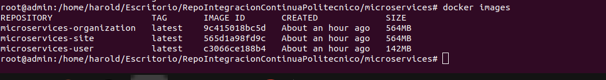
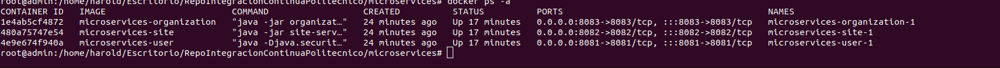

# Integración continua, implem
entación docker compose - microservice Java

Creación de múltiples microservicios con Spring Boot e implementación y ejecución con docker compose.

## Tabla de contenido

* [Arquitectura](#Arquitectura)
* [Tecnologias](#Tecnologias)
* [Pre-requisitos](#Prerequisitos)
* [Travis-CI](#Travis)
* [Push imagen docker hub con Travis](#PushImagen)

## Arquitectura

El proyecto esta construido en microservicios. Tenemos tres microservicios independientes (Usuario,
Sitio y Organización), que se conectan a la base de datos H2 y se comunican entre sí mediante RestTemplate. Usamos
Docker Compose para implementarlos y ejecutarlos en contenedores docker.

## Tecnologias

1. Java 8
2. Maven Dependency Management
3. Spring Boot in microservices development:

    + Spring Web
    + Spring Data JPA
    + Spring Devtools
    + Spring Actuator

4. H2 database
5. Docker

### Prerequisitos

Se necesitan las siguientes herramientas:

* Java JDK 1.8+
* Maven 3.0+
* Git client
* Docker Compose: To [install docker-compose](https://docs.docker.com/compose/install/)

### Desarrollo

Pasos a seguir:

**Paso 1.** Construcción de *microservicios* usando Spring Boot y comunicación entre ellos por RestTemplate:

+ [Organization microservice](organization-service)

**Paso 2.** Crear el *Dockerfile* para cada servicio. El archivo Docker es una lista de comandos que queremos que el
motor de la ventana acoplable
ejecutar.

Vaya al directorio de cada proyecto Spring Boot y cree un Dockerfile:

+ Organization microservice [Dockerfile](organization-service/Dockerfile)

Ejemplos Dockerfile

```bash
FROM openjdk:8-jdk-alpine
RUN addgroup -S devopsc && adduser -S javams -G devopsc
USER javams:devopsc
ENV JAVA_OPTS=""
ARG JAR_FILE
ADD ${JAR_FILE} app.jar
 # use a volume is mor efficient and speed that filesystem
VOLUME /tmp
EXPOSE 7280
ENTRYPOINT [ "sh", "-c", "java $JAVA_OPTS -Djava.security.egd=file:/dev/./urandom -jar /app.jar" ]
```

**Paso 4.** Ejecutar y probar aplicaciones:

Ejecute docker-compose up y se iniciara y ejecutara todos sus servicios.

### Configuración

Para ejecutar este proyecto, instálelo localmente de la siguiente manera:

1. **Clonar**

   ```bash
   git clone https://github.com/HaroldHorta/continuous-integration-poli.git
   ```

2. **Cree un archivo JAR para cada servicio**

   Ejecutar comando maven - *clean install*, y se crea un archivo jar en el directorio de destino para cada servicio de
   la siguiente manera:

   ```bash
   cd directorio_microservicio
   maven clean install
   ```	
   + *directorio_microservicio*: es cada directorio del repositorio (user-service, site-service y organization-service).	

3. **Inicie el usuario, el sitio y la organización usando docker-compose**

El proyecto incluye un archivo [*docker-compose.yml*](docker-compose.yml) para que pueda ejecutar *docker-compose up*
para comenzar
Servicios completos, no necesita instalación.

   ```bash
   cd solution_directory
   docker-compose up -d
   ```

Puedes ver -

- Construcción de una imagen desde Dockerfile para cada servicio si no existe.
- Construcción de contenedores (usuario, sitio, organización) usando las imágenes.
- Inicio de los servicios (usuario, sitio, organización).

1. **Consulta las imágenes creadas**

   Use el siguiente comando para verificar las imágenes creadas:

   ```bash
   docker images
   ```

   

2. **consulte los containers creados**

   ```bash
   docker ps -a
   ```
   

3. **revise logs**

   ```bash
   docker container logs CONTAINER_ID
   ```

## Travis
Ingresamos a la página oficial de travis


iniciamos sesion con gitHub


creamos el archivo .travis.yml

 ```bash
  dist: xenial
services:
  - docker
language: java
jdk:
  - openjdk8
before_install:
  - mvn clean
  - echo "$DOCKER_PASS" | docker login  -u "$DOCKER_USER" --password-stdin
  - docker pull openjdk:8-jdk-alpine

install:
  - mvn -N io.takari:maven:wrapper
  - ./mvnw install -DskipTests=true -Dmaven.javadoc.skip=true -B -V

after_success:
  - docker login -u $DOCKER_USER -p $DOCKER_PASS
  - export TAG=latest
  - export IMAGE_NAME=hahortasuarez/organization-service
  - docker build -t $IMAGE_NAME:1 .
  - docker tag $IMAGE_NAME:1 $IMAGE_NAME:$TAG
  - docker push $IMAGE_NAME

   ```
Creamos un token de acceso en docker-hub


Configuramos las variables de entorno en travis-ci


Realizamos push sobre el repositorio a la rama configurada


   ```bash
   git push origin master
   ```
Ya con eso veremos el pipeline ejecutarse 


Validamos en los logs la ejecucion 


Validamos dockerHub


### Running

Para acceder a los servicios utilice los siguientes endpoint

**Ejecute los microservicios de Organization**


El microservicio de la organización comenzará en el puerto `8083`, por lo que podrá visitar el microservicio de la
organización en
`http://localhost:8083`.

+ Ver información sobre microservicios (Site, User and Organization)
    * http://localhost:8083/actuator/info

+ Comprobar el estado de cada microservicio
    * http://localhost:8083/actuator/health

+ Acceder a las API de los servicios:
    * http://localhost:8081/api/organizations


## Ejemplos

### Organizacion APIs

* Info microservicio Organizacion

http://localhost:8083/actuator/info'

* Health para microservicio organizacion

http://localhost:8083/actuator/health'

* Lista todas las organizaciones
* 
http://localhost:8083/api/organizations'

